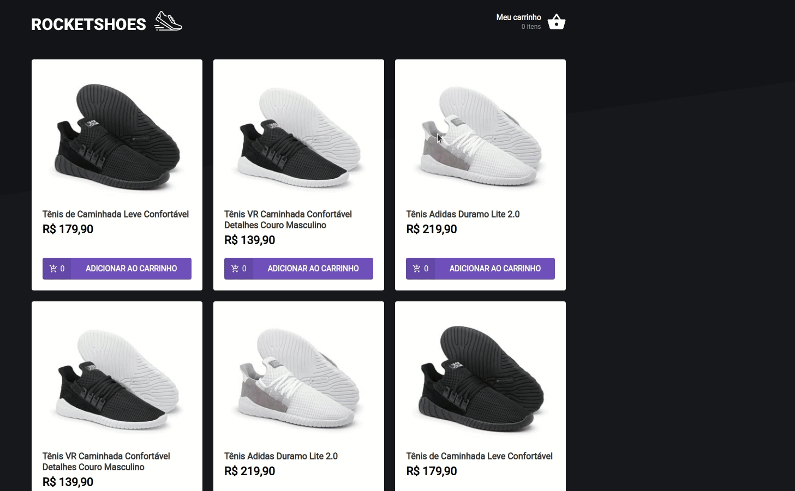
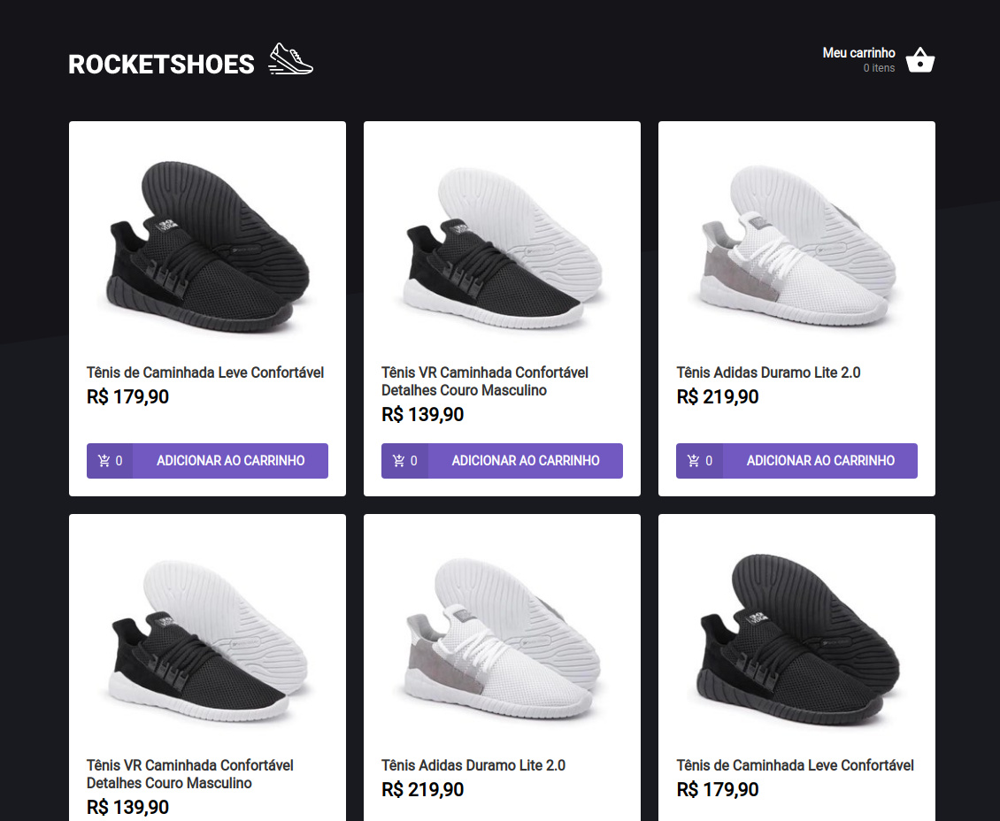
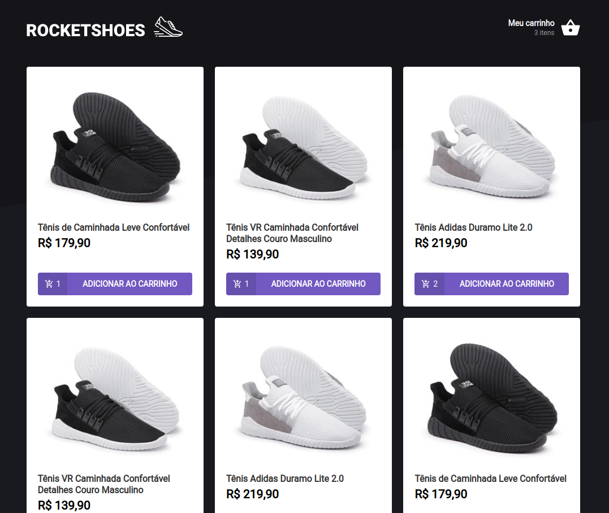
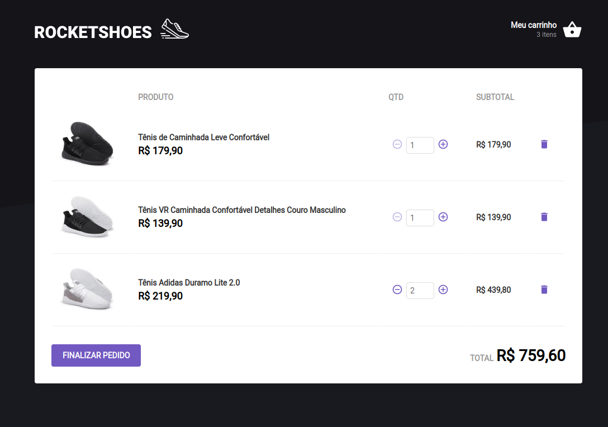

<h1 align="center">Rocketshoes</h1>
 

# :pushpin: Index
- [Project Media](#camera_flash-project-media)
- [About](#monocle_face-about)
- [Technologies](#rocket-technologies)
- [Author](#closed_book-author)
 

---
# :camera_flash: Project Media

  
  
  
  

 

---
# :monocle_face: About
This project was developed to practice React, Typescript, Custom Hooks and Context API.

Two API's were consumed by Axios, one for Products and one for Stock.
You can add products to the cart and their quantity will be informed on the main screen.
It contains error warnings when you try to add more products than the stock allowed and other occasions like decreasing non-existent items.

 

---

# :rocket: Technologies
This project was developed with the following technologies:  
- :heavy_check_mark: **ReactJS**
- :heavy_check_mark: **React Hooks**
- :heavy_check_mark: **Context API**
- :heavy_check_mark: **Typescript**
- :heavy_check_mark: **Styled Components**
- :heavy_check_mark: **JSON web server**
- :heavy_check_mark: **React Toastify / Icons**
  
 

---

# :closed_book: Author
By [Patrick Morais](https://github.com/PatrickMoraisN).
### :link: LinkedIn: https://www.linkedin.com/in/patrick-morais/